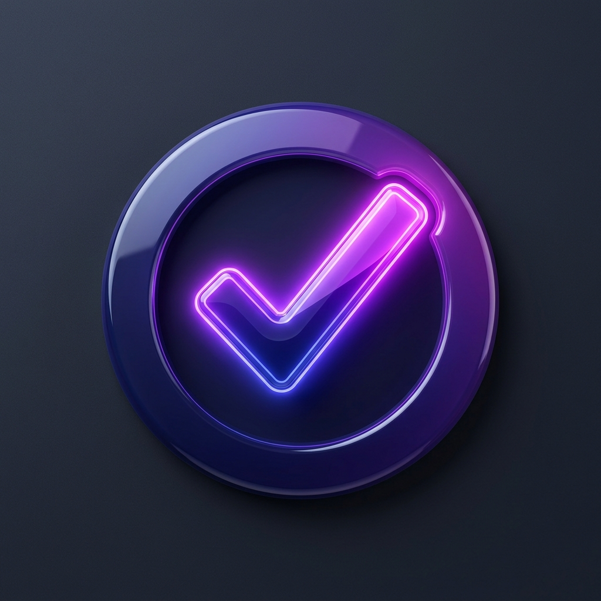

# 📌 TaskFlow - Premium To-Do Manager

<p align="center">
  
</p>

<p align="center">
  <b>A Luxury, Offline-First Task Management Application built in Flutter</b><br/>
  Featuring proper MVC architecture, reactive state management using GetX, and local SQLite data persistence.
</p>

<p align="center">
  
  
  
  
  
</p>

---

## ✨ Features

*   **🎬 Premium Animated Splash Screen**: Custom circular checkmark logo with smooth elastic scaling animations and a pulsating breathing shadow halo.
*   **📖 Onboarding Walkthrough**: A beautiful 3-slide visual onboarding sequence loading custom vector-style graphics that guides new users on app capabilities.
*   **📊 Dashboard Statistics Card**: Displays real-time task statistics (tasks completed, ratio percentages) with a dynamic circular progress indicator.
*   **🏷️ Categorization & Tags**: Custom chip selectors grouping tasks dynamically into categories (Work, Personal, Health, Shopping, Others) with matching color-coded indicator lines.
*   **⚙️ Advanced Sorting & Search**:
    *   Sort tasks by Date, Priority (High/Medium/Low), or Completion Status.
    *   Dynamic instant text-searching.
    *   Advanced Multi-Filter Search screen allowing cross-queries based on keywords, status checks, and priority.
*   **🧩 Reusable Components**: Codebase refactored into modular widgets (`TaskCard`, `ProgressCard`, `CategoryFilterList`) for maintainability.
*   **💼 Fully Persistent (Sqflite)**: Data remains fully saved offline using local SQLite database CRUD transactions. Onboarding visto status is also preserved locally.

---

## 🎨 Luxury Theme Color System

TaskFlow features a rich, luxurious warm color palette based on deep wine-reds and soft creams, ensuring readability and visual pleasure in both light and dark settings:

*   **Burgundy / Wine Red (`#7B0828`)**: Primary brand color representing actions, active buttons, and titles.
*   **Soft Cream / Ivory (`#F4EBD9`)**: The base background for the Light Theme and primary text color in Dark Mode.
*   **Warm Tan / Sage (`#DECBAF`)**: Highlights, card outlines, and secondary text indicators.
*   **Dark Chocolate / Maroon (`#3D0C11`)**: Root background for Dark Mode, ensuring a soft glowing high-contrast dark visual.

---

## 📂 Project Architecture (MVC Pattern)

This project strictly adheres to the **Model-View-Controller (MVC)** design pattern, separating concerns for high code readability:

```
lib/
├── controllers/          # Business logic, state streams, DB querying (C)
├── models/               # Data structures and JSON/Map serialization (M)
├── services/             # Core engines, Singleton Database helpers
├── utils/                # Styling variables, color themes, icon helpers
└── views/                # Modular screens and extracted reusable widgets (V)
```

*   **Model**: [todo_model.dart](lib/models/todo_model.dart) represents individual task fields and database converters.
*   **View**: Contains individual directories for Splash, Onboarding, Home, Search, and About layouts.
*   **Controller**: Uses GetX reactive properties (`.obs`) to manage UI rebuilds inside `Obx` observers automatically.

---

## 🛠️ Tech Stack & Dependencies

*   **Flutter SDK**: Single codebase cross-compilations.
*   **GetX**: Used for reactive state management, simple dependency injection, and context-free route navigations.
*   **Sqflite**: Low-level SQLite database library for secure, fast device persistence.
*   **Path**: Handles cross-platform directory lookup for DB tables.

---

## 🚀 Getting Started & Installation

To run this project locally, ensure you have the Flutter SDK installed on your machine.

### 1. Clone the repository
```bash
git clone https://github.com/Ziauddin-developer/To-DO-App-.git
cd To-DO-App-
```

### 2. Install dependencies
```bash
flutter pub get
```

### 3. Verify codebase linting
```bash
flutter analyze
```

### 4. Build and run the app
Connect a device or emulator and run:
```bash
flutter run
```

---

## 📖 Educational Learning Guide

Are you a student preparing this project for a classroom task or presentation? We've got you covered! 

Open the **[GUIDE.md](GUIDE.md)** file in the root directory. It contains:
*   A step-by-step breakdown of Flutter and Dart basics.
*   A detailed explanation of MVC architecture.
*   GetX reactive state principles.
*   Common questions and correct answers your teacher might ask you during presentations (Vivas).
